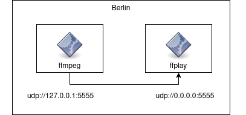
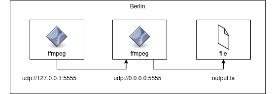
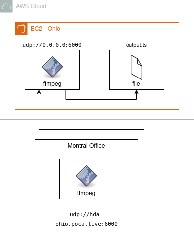
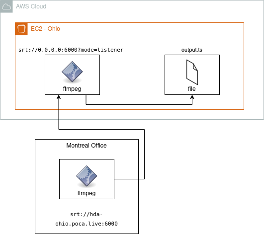
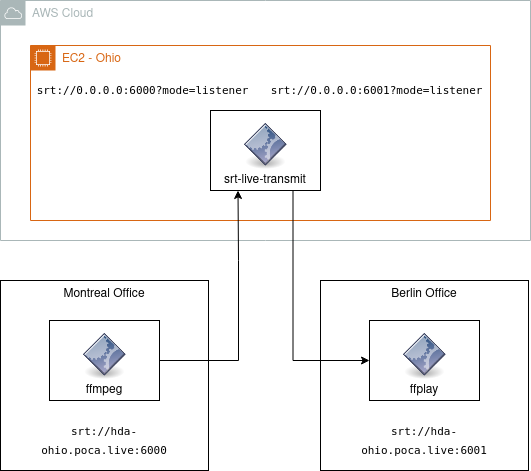
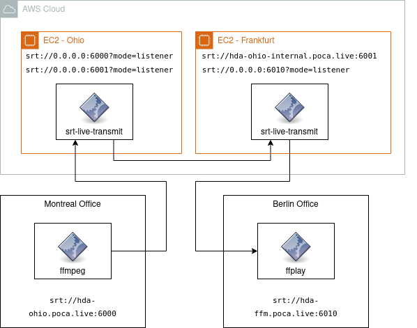

## Generating a test-stream



### Generator
```bash
ffmpeg -re -f lavfi -i testsrc2=size=1920x1080:rate=25 \
       -codec:v libx264 -preset fast \
       -f mpegts udp://127.0.0.1:5555
```

### Receiver
```bash
ffplay udp://0.0.0.0:5555
```

---


## Recording a stream



### Generator
```bash
ffmpeg -re -f lavfi -i testsrc2=size=1920x1080:rate=25 \
       -codec:v libx264 -preset fast \
       -f mpegts udp://127.0.0.1:5555
```

### Receiver
```bash
ffmpeg -i udp://0.0.0.0:5555 \
       -codec:v copy \
       output.ts
```

### Playback
```bash
ffplay output.ts
```
---

## Receiving a stream in Ohio Datacenter from Montreal using raw UDP



### Generator (Montreal RIEDEL Office)
```bash
ffmpeg -re -f lavfi -i testsrc2=size=1920x1080:rate=25 \
       -codec:v libx264 -preset fast -intra -crf 17 \
       -f mpegts udp://hda-ohio.poca.live:6000
```

### Recorder (Ohio Datacenter)
```bash
ffmpeg -i udp://0.0.0.0:6000 \
       -codec:v copy \
       output.ts
```

### Downloading the recorded file to Berlin
```bash
scp ubuntu@hda-ohio.poca.live:~/output.ts output.ts
```

---
## Receiving a stream in Ohio Datacenter from Montreal using SRT



### Generator (Montreal RIEDEL Office)
```bash
ffmpeg -re -f lavfi -i testsrc2=size=1920x1080:rate=25 \
       -codec:v libx264 -preset fast -intra -crf 17 \
       -f mpegts srt://hda-ohio.poca.live:6000
```

### Recorder (Ohio Datacenter)
```bash
ffmpeg -i "srt://0.0.0.0:6000?mode=listener" \
       -codec:v copy \
       output.ts
```

### Downloading the recorded file to Berlin
```bash
scp ubuntu@hda-ohio.poca.live:~/output.ts output.ts
```

---
## Relaying a stream from Montreal to Berlin

### Relay (Ohio Datacenter)

```
srt-live-transmit "srt://0.0.0.0:6000?mode=listener" \
                  "srt://0.0.0.0:6001?mode=listener"
```

### Generator (Montreal RIEDEL Office)
```bash
ffmpeg -re -f lavfi -i testsrc2=size=1920x1080:rate=25 \
       -codec:v libx264 -preset fast -intra -crf 17 \
       -f mpegts srt://hda-ohio.poca.live:6000
```

### Receiver (Berlin)
```
ffplay srt://hda-ohio.poca.live:6001
```

### Receiver (lower latency) (Berlin)
```
mpv --no-cache srt://hda-ohio.poca.live:6001
```

---
## Relaying a stream from Montreal over Frankfurt to Berlin

### Relay (Ohio Datacenter)
```
srt-live-transmit "srt://0.0.0.0:6000?mode=listener" \
                  "srt://0.0.0.0:6001?mode=listener"
```

### Relay (FFM Datacenter)
```
srt-live-transmit "srt://hda-ohio-internal.poca.live:6001" \
                  "srt://0.0.0.0:6010?mode=listener"
```

### Generator (Montreal RIEDEL Office)
```bash
ffmpeg -re -f lavfi -i testsrc2=size=1920x1080:rate=25 \
       -codec:v libx264 -preset fast -intra -crf 17 \
       -f mpegts srt://hda-ohio.poca.live:6000
```

### Receiver (Berlin)
```
ffplay srt://hda-ffm.poca.live:6010
```

### Receiver (lower latency) (Berlin)
```
mpv --no-cache srt://hda-ffm.poca.live:6010
```

